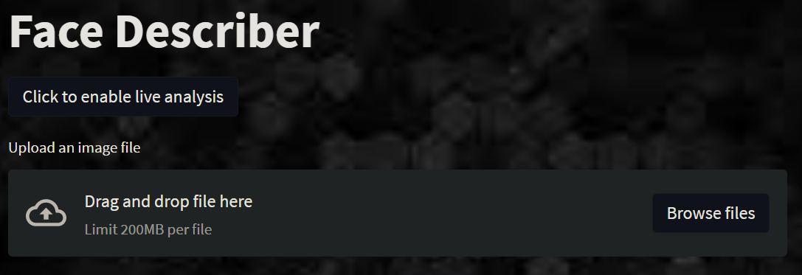
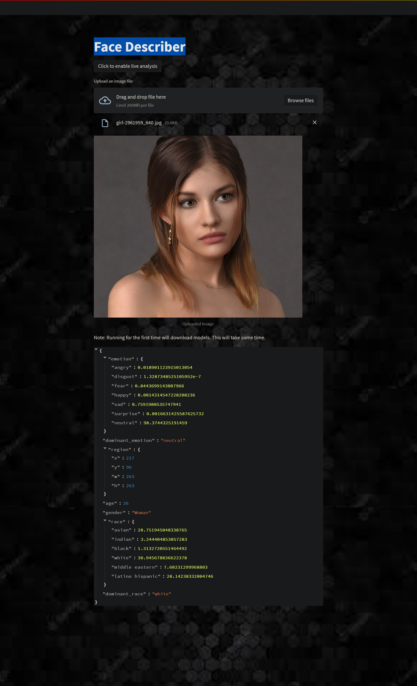

## Face Describer

### A python web app that tells information about detected faces in images or live video footage

# Credits:

## Johann Pineda:

[theonejohann - Github](https://github.com/theonejohann)

[Johann Pineda | LinkedIn](https://www.linkedin.com/in/johann-pineda-97992a235/)

[Johann - Medium](https://medium.com/@theoneonlyjohann)

[johann (@theoneandonlyjohann) * Instagram photos and videos](https://www.instagram.com/theoneandonlyjohann/)